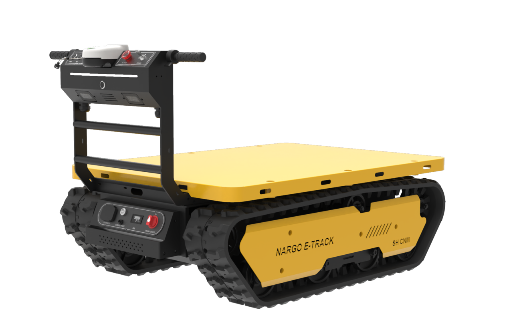

# VIL-Project-AMR

Autonomous navigation on unstructured mountain terrain using Vision-Inertial-LiDAR fusion — without GPS or pre-built maps.

<p align="center">
  
</p>

---

## Hardware

| Component | Model | Note |
|-----------|-------|------|
| Platform | OMOROBOT DONKEYBOTI | Tracked, skid-steer |
| LiDAR | Pacecat LDS-M300-E | 3D, 200kHz, 360×70° FOV, built-in 6-axis IMU |
| Camera | MRDVS S10 Ultra | dToF, 120×80° FOV, XYZRGB point cloud |
| Computer | Dragonwing IQ-9075 | Qualcomm QCS8550, ARM64 |
| OS | Ubuntu 24.04, ROS2 Jazzy | |

---

## Packages

### Sensor Drivers

| Package | Description | Source | License |
|---------|-------------|--------|---------|
| pacecat_m300 | M300-E 3D LiDAR + IMU driver | [BlueSeaLidar/m300](https://github.com/BlueSeaLidar/m300) | MIT |
| lx_camera_ros | S10 Ultra dToF camera driver | [Lanxin-MRDVS/CameraSDK](https://github.com/Lanxin-MRDVS/CameraSDK) | Proprietary (SDK) |

### Perception

| Package | Description | Source | License |
|---------|-------------|--------|---------|
| fast_lio | FAST-LIO2 with M300 support (LiDAR type 5), livox dependency removed | [hku-mars/FAST_LIO (ROS2)](https://github.com/hku-mars/FAST_LIO/tree/ROS2) | GPL-2.0 |
| cloud_merger | Merges M300 + S10 Ultra point clouds in body frame | Original | BSD-3 |
| groundgrid | Grid-based ground segmentation and elevation mapping | [dcmlr/groundgrid (ros2-jazzy)](https://github.com/dcmlr/groundgrid/tree/ros2-jazzy) | BSD-3 |
| terrain_costmap | 3m×3m robot-centric traversability costmap from GroundGrid output | Original | BSD-3 |

### Navigation

| Package | Description | Source | License |
|---------|-------------|--------|---------|
| path_planner | A* global planner + DWA local planner for skid-steer kinematics | Original | BSD-3 |

### Robot Platform

| Package | Description | Source | License |
|---------|-------------|--------|---------|
| omorobot | DONKEYBOTI tracked robot: URDF, motor control, bringup | [omorobot/omorobot_ros2](https://github.com/omorobot/omorobot_ros2) | Apache-2.0 |

> See each package's `README.md` for detailed descriptions, parameters, and topic configurations.

---

## Build

```bash
mkdir -p ~/amr_ws
cd ~/amr_ws
git clone https://github.com/Hyeokk/VIL-Project-AMR.git src

rosdep install --from-paths src --ignore-src -r -y
colcon build --symlink-install
source install/setup.bash
```

---

## Launch

Each node group runs in a separate terminal.

```bash
# 1. Robot platform (motor + URDF TF)
export ROBOT_MODEL=DONKEYBOTI
ros2 launch omorobot_bringup bringup_launch.py publish_tf:=false

# 2. M300 LiDAR driver
ros2 launch pacecat_m300_driver LDS-M300-E.launch.py

# 3. FAST-LIO2 + static TF bridges
ros2 launch fast_lio mapping.launch.py

# 4. S10 Ultra camera driver
ros2 launch lx_camera_ros lx_camera_ros.launch.py

# 5. Point cloud merger
ros2 launch cloud_merger cloud_merger.launch.py

# 6. Ground segmentation
ros2 launch groundgrid amr_groundgrid.launch.py

# 7. Terrain costmap
ros2 launch terrain_costmap terrain_costmap.launch.py

# 8. Path planner (A* + DWA)
ros2 launch path_planner path_planner.launch.py
```

---

## Testing Without Sensors

```bash
# Terminal 1: Simulated sensor data + TF
python3 test/test_pipeline.py

# Terminal 2-3: cloud_merger and GroundGrid (same as above)

# Terminal 4: Real-time Hz and latency monitor
python3 test/test_monitor.py
```

---

## Docs

| Document | Description |
|----------|-------------|
| [docs/Network.md](docs/Network.md) | IQ-9075 network setup: WiFi + LiDAR + Camera routing |
| [docs/Monitoring.md](docs/Monitoring.md) | Remote rviz2 visualization via Docker (Jazzy + CycloneDDS) |

---

## License

Each package retains its original license. See individual package directories.